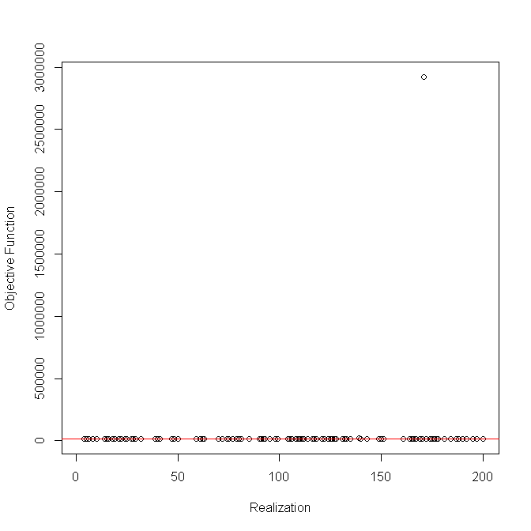

# jitter

The ability to change the initial guesses slightly (known as jittering) for an ASAP run is now available in the ASAPplots package (https://github.com/cmlegault/ASAPplots). This site contains a number of worked examples demonstrating how this approach can be used to help diagnose problems with a model formulation or demosntrate that a model formulation is robust to a wide range of intitial guesses.

See examples.R for the code used to produce the following results. The rest of the R files are now part of ASAPplots, they are included here only so readers can more easily see the functions. These files will not be updated, see ASAPplots for the most recent versions of the functions.

Seven recent ASAP assessment input files were collected from https://www.nefsc.noaa.gov/saw/sasi/sasi_report_options.php for this demonstration: Gulf of Maine cod, Gulf of Maine haddock, pollock, redfish, Southern New England - Mid Atlantic winter flounder, Southern New England - Mid Atlantic yellowtail flounder, and white hake. A separate directory was created for each stock containing the .dat file for that stock. The ASAP3 GUI (https://www.nefsc.noaa.gov/nft/) was used to run the stock assessment and produce estimates. All seven stocks ran successfully producing positive definite hessians (meaning the model converged at a local minimum). A question for any relatively highly parameterized stock assessment model is whether the found local minimum is in fact the global minimum or if a better solution exists with some other combination of parameter estimates. 

To conduct the jitter analysis, you need the same two variables as used in ASAPplots (wd and asap.name) along with the number of random realizations of initial guesses. The function also contains a number of default parameters that will be described below in more detail. For example, if I have a folder called jitter_asap on my desktop with a subfolder called whitehake containing whitehake.dat, then the following four lines of code will run the ASAP program 200 times with different initial guesses for each run:

wd <- "C:\\Users\\chris.legault\\Desktop\\jitter_asap\\whitehake"
asap.name <- "whitehake"
njits <- 200
whitehakeres <- RunJitter(wd, asap.name, njits)

The RunJitter function will automatically create a subfolder called jitter in the wd directory that has 200 pin files names jitter1.pin, jitter2.pin, ..., jitter200.pin and for each successful model run there will be files jitterX.par and jitterX.rdat where X is an integer between 1 and 200 (some models may not converge and those results are not saved). The console will show the progress of the analysis, reporting the objective function value for each realization or noting that the realization did not converge. This analysis may take a while to run depending on how long the original model took to converge and how many realizations are requested. The function also defaults to saving a copy of the resulting plot of objective function value versus realization with a solid, horizontal line marking the original solution. For example, the white hake example produced:

This plot shows that the white hake model is robust to randomly jittered initial guesses with all 200 realizations producing the same objective function value as the original model. This can be seen by typing

whitehakeres

which shows the 200 realizations under objfxn and the original objective function value under orig_objfxn, with all 201 values identical. This consistency does not always happen. There may be some realizations that report NA as the objective function, as is the case for Southern New England - Mid Atlantic yellowtail flounder:

where realizations 9, 109, 141, and 176 did not converge. This can be seen by looking in the jitter directory for which .pin files do not have corresponding .par and .rdat files, or more simply by typing in the console

which(is.na(snemaytres$objfxn))

assuming snemaytres was the name of the variable used to call RunJitter. However, not all models are this robust. Sometimes there are a small number of runs that converge to results that are clearly much worse than the rest of the realizations, making it hard to see on the plot if all the runs near the original solution have the same value, for example redfish:

In this case, the function PlotJitter can be used interactively to see the effect of truncating the upper range of the ojbective function values. For example, in the redfish case, the upper limit for the y-axis could be set to 20530 using the following call:

PlotJitter(redfishres, FALSE, base.dir, 'png', FALSE, 20530)

Any value that was originally greater than 20530 is replaced by 20530 and shown as a filled triangle in the plot:

To see the parameters of this (or any other function in R) simply type:

?PlotJitter

Alternatively, if you are interested in the code you can type:

PlotJitter

note there are no parentheses in this command. 

You are often interested in how many, and which, realizations have objective function values less than the original one. Such realizations indicate the exisitence of at least one solution that is better than the original one, in terms of the objective function value. If reslist is the name used to call RunJitter, you can find if such a case exists by typing:

which(reslist$objfxn < reslist$orig_objfxn)

This can also be shown on the plot by setting showtitle to TRUE in either functions PlotJitter or RunJitter. 

Sometimes the small number of different objective function values do not hide other results, as is the case for Gulf of Maine haddock:

But sometimes they do, as for pollock:

compared with 

Other times there are just a nubmer of alternative solutions, but the original plot shows them well, as for Gulf of Maine cod:

And perhaps most interestingly, sometimes there are two alternative solutions that have large numbers of realizations, as is the case for Southern New England - Mid Atlantic winter flounder:

In this case, the original model found the lower of the two objective function values, but it raises the question of how different are these two solutions. This can be found by selecting a run with each objective function value and plotting the spawning stock biomass trends over time:

This plot shows the two SSB time series are quite different and would almost certainly have different implications for management. This is a situation that would deserve further exploration of the results to see what was driving these differences and whether alternative models should be considered in this case. Hint, the fleet selectivities are quite different between these two cases. This same approach can be used for pollock:

which shows the same trend scaled up or down a bit among the many different objective function values and Gulf of Maine cod:

which is more problematic in that the trends differ among the objective function values, with the lowest objective function value associated with the lowest SSB trend in this case.

## Technical details

As seen by the help page for the RunJitter function, there are a number of variables in the function call that have default values. The ploption is one that can be used to explore searching the full range of possible values for every parameter (set ploption="full"). The examples.R file shows how this can be done and the initial guesses for ploption="jitter" vs ploption="full" compared to the original solution for a number of parameters:

The jitter approach covers a much smaller range of initial guesses than the full option. There are some seemingly oddities associated with the jitter approach when the original solution is near one of the bounds for the parameter, for example log_SR_scalar where few of the jittered values are close to the original value. The JitterASAP function has example code commented out at the bottom of the function to allow users to explore how the Stock Synthesis approach to jittering is computed. 

The save.plots and plotf variables in the RunJitter function are the same as in ASAPplots. The od variable functions similarly to ASAPplots, but defaults to the jitter subdirectory instead of the plots subdirectory. This can be changed to have the plot go to the plots subdirectory using:

od=paste0(wd,"\\plots\\")

The ReadASAPDatFile and ReadASAPPinFile functions assume the NOAA Fisheries Toolbox GUI has been used to run the original file, and that the file has already successfully run. If you modify the input files by hand, these functions may not work.

Another way to look at the results is to see which of the jittered realizations met some criterion for converging beyond just a positive definite Hessian. One common test is a maximum gradient of less than 0.001. Examining the maximum gradient (note the use of log10 scale) versus the objective function (note the extreme values are plotted at the truncated values for pollock and redfish) for six of the stocks demonstrates that realizations with the same objective function may have different maximum gradients and that there are many realizations that meet the criterion despite having a higher objective function. Thanks to Liz Brooks for suggesting this way of looking at the results.

